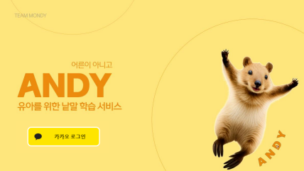
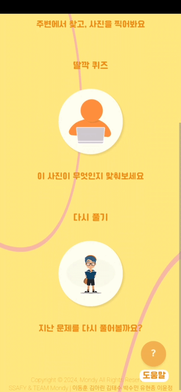

# 유아를 위한 낱말 학습 서비스 : Andy 

  

## 📌프로젝트 정보
> SSAFY 10기 AI 특화 프로젝트 - 게임을 통한 유아 낱말 학습 웹 어플리케이션
> 
> 개발 기간 : 2024.02.19 ~ 2024.04.05

##### 🤔 왜 Andy가 필요할까요?
- 수동적 학습의 한계 극복: 미디어 학습은 유아 학습의 적극적 참여를 제한하며, 이로 인해 학습 성취도가 떨어질 수 있습니다. 이 한계를 극복하기 위해 Andy를 제안합니다.

- 오감을 활용한 학습 경험 제공: Andy는 실제 사물과의 접촉을 통한 오감 학습을 가능하게 하여, 단순 지식 전달을 넘어 실질적인 이해와 체험을 제공합니다. 이를 통해 학습의 지평을 넓히고 더 많은 기회를 제공합니다.

Andy는 적극적 참여와 직접 경험을 통해 학습자에게 더 깊이 있는 지식 습득을 가능하게 합니다.

##### 👨‍👩‍👧‍👦 사용자 친화적인 UI/UX
- 유아 친화적인 UI 제공 : 유아들이 쉽게 이해할 수 있도록 밝은 색상, 직관적인 아이콘, 읽기 쉬운 글꼴을 사용합니다. 또한, 기능과 카테고리를 이미지로 설명하여 유아들이 서비스를 더 쉽게 이해하도록 합니다.

- 모바일 웹 및 반응형 디자인 : 모든 기기에서 동일한 사용자 경험을 제공하기 위해 반응형 디자인을 적용합니다. 이를 통해 화면 크기에 맞춰 콘텐츠와 레이아웃이 자동으로 조정됩니다.

##### 🏃‍♂️ 풍부한 학습 경험
- 찰칵 퀴즈 : 단어를 보고 주변의 실제 사물을 찾아 객체 인식을 통해 맞추는 방식으로, 현실 세계와 연결된 학습을 경험할 수 있습니다.
- 딸깍 퀴즈 : 사진을 보고 해당하는 단어를 맞추는 방식으로, 시각적 정보를 통한 언어 학습을 강화합니다.
- 다시 풀기 : 틀린 문제들을 모아 언제든지 다시 풀 수 있는 기능으로, 학습의 효율을 높이고 지식을 확실히 기억하는 데 도움을 줍니다.

이 3가지 모드를 통해 학습자는 자신에게 맞는 방식으로 지식을 탐색하고, 즐겁게 학습할 수 있습니다. 

##### 📚 행복 기록을 통한 성취감 향상
- 일일/월별 기록 조회 : 달력 내에서 일일/월별 조회를 통해 자신의 학습 진행 상황을 한눈에 확인할 수 있어, 꾸준한 학습 습관 형성에 도움을 줍니다.
- 시각적 성취감 향상 : 학습을 완료할 때마다 행복 이미지가 색칠되어, 학습의 진행 상황을 시각적으로 확인할 수 있습니다. 이는 학습자에게 성취감을 주어 학습 의욕을 증진시킵니다.

## 😃 팀 구성

| [이동훈](https://github.com/Alleestar)                                                    | [김태수](https://github.com/benyy0101)                                                     | [김아린](https://github.com/lynne921)                                                                                          | [박수민](https://github.com/sueminPark)                                                   | [유현종](https://github.com/Drawjustin)                                                   | [이윤정](https://github.com/jjeong41)                                                      |
| ----------------------------------------------------------------------------------------- | ----------------------------------------------------------------------------------------- | ------------------------------------------------------------------------------------------------------------------------------ | ------------------------------------------------------------------------------------------ | ------------------------------------------------------------------------------------------ | ----------------------------------------------------------------------------------------- |
|  |  |  |  |  |  |
| Leader, AI                                                                             | Front                                                                               | Back                                                                                                                          | Back, CI&CD                                                                                       | Back                                                                                       | Front                                                                              |
| AI 모델 설계 및 학습 AI 서버(Fast API) 구현                                                          | 로그인  전역상태 및 리액트 쿼리 캐싱  찰칵퀴즈 구현(카메라 및 반응형)  PWA 환경구축                                          | 인증/인가 마이페이지 API 카카오 로그인 S3 이미지 업로드                           | 찰칵/딸깍 퀴즈 및 결과 페이지   카테고리  페이지 구현  페이지 반응형 작업                             | 인증/인가  게임 API 카카오 로그인  CI&CD                                                 | 프로필 생성 페이지  프로필 목록 페이지  마이페이지  이용 가이드 구현                                                                    |

 

## 배포 주소
> [홈 페이지 바로가기](https://j10a102.p.ssafy.io/main)

## 🛠️ 기술 스택

**AI**
 

**Front**
 

**Back**
 

**Database**
 

**Environment**
 

**Cooperation**
 

 

## 🌐 Setting

[포팅 메뉴얼 바로가기](./exec/comeet_porting_manual.md)

## 🎨 아키텍처

## 💡 주요 기능

### 1. 메인 화면

- 프로필 화면으로 넘어갈 수 있음

### 2. 카카오 로그인 및 프로필 선택
| | 웹 | 모바일 |
|---|---|---|
| 로그인 |  |  |
| 튜토리얼 |  |  |

- 카카오 소셜 로그인 지원
- 계정별 다수 프로필 관리 및 선택 가능
- 프로필 신규 생성 후 메인페이지 이동 가능
- 도움말을 통한 쉽고 직관적인 가이드 제공

### 3. 게임(찰칵퀴즈) 단어->물체

| | 웹 | 모바일 |
|---|---|---|
| 게임 카테고리 |  | ! |
| 게임 시작 |  |  |
| 게임 정답 |   |  |
| 게임 종료 |  |  |

- 찰칵퀴즈 : 단어를 보고 사물을 찾는 게임으로, 사진을 찍으면 객체 인식을 통해 정답 여부를 판정
- 다양한 카테고리 내 문제 풀이 가능
- 정오답 모달을 통한 정답 여부와 정답 내용 제공
- '넘어가기' 버튼을 통한 문제 건너뛰기 편의성 제공

### 4. 게임(딸깍퀴즈) 물체->단어

| | 웹 | 모바일 |
|---|---|---|
| 게임 시작 |  |  |
| 게임 정답 |  |  |

- 딸깍퀴즈 : 물체를 보고 단어를 맞추는 게임
- 다양한 카테고리 및 문제 조회가 가능
- 물체의 정답을 보고, 틀리더라도 다시 한번 올바른 단어를 띄움으로써 쉽고 자연스러운 학습 가능

### 5. 다시해보기

| | 웹 | 모바일 |
|---|---|---|
| 다시 해보기 |  |  |

- '다시하기'를 통해 틀린 문제 복습 기능 제공
- 틀린 날짜와 내역이 쭉 나오고, 선택해서 풀 수 있음
- 맞을 경우 틀린 내역에서 삭제되고, 마이페이지에도 반영되어 점수가 변경됨.

### 6. 마이페이지

| | 웹 | 모바일 |
|---|---|---|
| 마이 페이지 |  |  |

- 달력 내 일일/월별 기록 조회
- 해결한 문제와 해당 문제가 속한 게임 모드, 맞춘 문제 등 세부 정보 확인 가능
- 기록이 있는 날짜에는 웃는 이모지를 표시 및 푼 날짜 계산을 통해 성취감 고양
- 우측에는 기록의 상세 정보를 제공하여 사용자가 자신의 학습 성취를 명확히 파악 가능